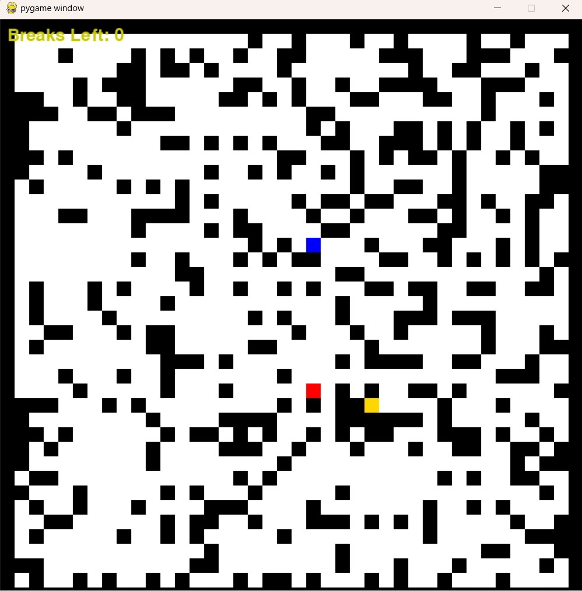
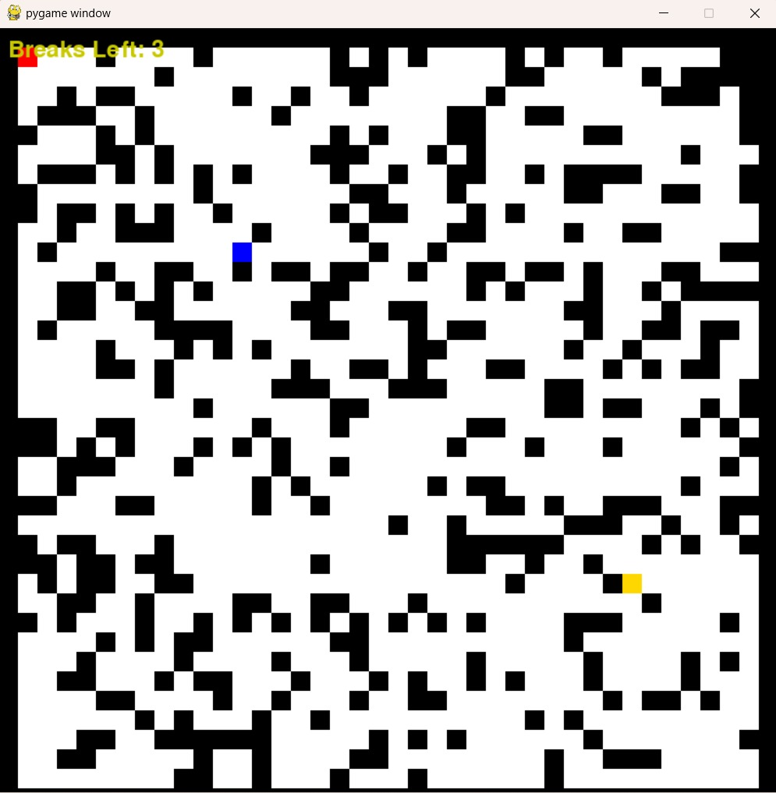

# Ex.No: 11  Mini Project 
#### DATE: 25/10/2024 
#### NAME: PRADEESH S
#### REGISTER NUMBER : 212221240038
## AIM: 
The aim of this program is to create a two player maze runner where one player is artificial intelligence using pygames and Dijkstra algorithm.

## Algorithm:
### 1. Imports and Initialization

- Import necessary libraries: `pygame`, `random`, and `heapq`.
- Initialize Pygame settings, screen size, colors, and constants.

### 2. Maze Generation

- **Function**: `generate_maze(grid_size)`
  - Generates a random maze with walls and open paths.
  - Sets a guaranteed start and goal position.
  - Ensures a path exists between the start and goal.

### 3. Pathfinding (Dijkstra's Algorithm)

- **Function**: `dijkstra(maze, start, goal)`
  - Finds the shortest path for the AI from its position to the goal.
  - Returns a list of coordinates for the path if a route exists.

### 4. Player Class

- **Class**: `Player`
  - Represents the player character.
  - Can move in four directions (left, right, up, down).
  - Has a limited number of block-breaking actions.

### 5. AIPlayer Class

- **Class**: `AIPlayer`
  - Inherits from `Player` but adds pathfinding logic.
  - Uses Dijkstra's algorithm to determine the shortest path to the goal.
  - Has a limited number of block-breaking actions.

### 6. Game Loop

- The main game loop handles:
  - **Player Input**: Processes arrow keys and space bar for player movement and block-breaking.
  - **AI Movement**: Moves the AI according to the shortest path, with different speeds depending on difficulty level.
  - **Drawing the Maze**: Updates the screen with the maze layout, player, AI, and goal.

---

## Difficulty Levels

1. **Easy**: Slow AI movement (higher `AI_SPEED_LIMIT`).
2. **Medium**: Moderate AI movement speed.
3. **Hard**: Fast AI movement (lower `AI_SPEED_LIMIT`).

## Program
```
# Prompt for difficulty level
difficulty = input("Select difficulty (easy, medium, hard): ").lower()

# Set AI speed based on difficulty level
if difficulty == 'easy':
    AI_SPEED_LIMIT = 30  # AI moves very slowly
elif difficulty == 'medium':
    AI_SPEED_LIMIT = 15  # AI moves moderately fast
elif difficulty == 'hard':
    AI_SPEED_LIMIT = 5  # AI moves very fast
else:
    print("Invalid input. Defaulting to medium difficulty.")
    AI_SPEED_LIMIT = 15
pygame.init()

GRID_SIZE = 40
TILE_SIZE = 20

SCREEN_WIDTH = GRID_SIZE * TILE_SIZE
SCREEN_HEIGHT = GRID_SIZE * TILE_SIZE

screen = pygame.display.set_mode((SCREEN_WIDTH, SCREEN_HEIGHT))

# Colors
WHITE = (255, 255, 255)
BLACK = (0, 0, 0)
RED = (255, 0, 0)
BLUE = (0, 0, 255)
GOLD = (255, 215, 0)

# Add a goal in the maze
goal_position = (GRID_SIZE - random.randint(5, 15), GRID_SIZE - random.randint(5, 15))  # Example: fixed goal position

ai_speed_counter = 0
# FPS
FPS = 24
clock = pygame.time.Clock()

def generate_maze(grid_size, goal_position):
    # Initialize the grid with walls
    maze = [[1 for _ in range(grid_size)] for _ in range(grid_size)]
    
    # Create open areas
    for x in range(1, grid_size - 1):
        for y in range(1, grid_size - 1):
            if random.random() > 0.3:  # 70% chance to create a path
                maze[x][y] = 0
    
    # Make sure the start (1, 1) and goal (grid_size-2, grid_size-2) are open
    maze[1][1] = 0  # Start position
    maze[goal_position[0]][goal_position[1]] = 0  # Goal position
    
    # Optionally: create a guaranteed path between the start and goal
    x, y = 1, 1
    while (x, y) != (grid_size - 2, grid_size - 2):
        if random.random() > 0.5:
            if x < grid_size - 2:
                x += 1
        else:
            if y < grid_size - 2:
                y += 1
        maze[x][y] = 0  # Carve out the path

    return maze
maze = generate_maze(GRID_SIZE, goal_position)

class Player:
    def __init__(self, x, y, color, breaks=3):  # Allow the player to break 3 blocks by default
        self.x = x
        self.y = y
        self.color = color
        self.breaks = breaks

    def move(self, dx, dy, maze):
        new_x, new_y = self.x + dx, self.y + dy
        if 0 <= new_x < GRID_SIZE and 0 <= new_y < GRID_SIZE:
            if maze[new_x][new_y] == 0:  # Move if path is clear
                self.x = new_x
                self.y = new_y
            elif maze[new_x][new_y] == 1 and self.breaks > 0:  # Break the wall if there are breaks left
                maze[new_x][new_y] = 0  # Break the wall
                self.breaks -= 1  # Reduce the break counter
                self.x = new_x
                self.y = new_y

    def draw(self, screen, tile_size):
        pygame.draw.rect(screen, self.color, (self.x * tile_size, self.y * tile_size, tile_size, tile_size))
player = Player(1, 1, RED)
ai_player = Player(10, 10, BLUE)
font = pygame.font.Font(None, 36)
breaks_text = font.render(f"Breaks Left: {player.breaks}", True, (100, 100, 100))
screen.blit(breaks_text, (10, 10))
def dijkstra(maze, start, goal):
    heap = [(0, start)]  # (cost, position)
    visited = set()
    came_from = {}

    while heap:
        cost, current = heapq.heappop(heap)
        
        if current in visited:
            continue
        visited.add(current)
        
        if current == goal:
            path = []
            while current in came_from:
                path.append(current)
                current = came_from[current]
            path.reverse()
            return path
        
        x, y = current
        for dx, dy in [(1, 0), (-1, 0), (0, 1), (0, -1)]:
            next_pos = (x + dx, y + dy)
            if 0 <= next_pos[0] < GRID_SIZE and 0 <= next_pos[1] < GRID_SIZE and maze[next_pos[0]][next_pos[1]] == 0:
                if next_pos not in visited:
                    heapq.heappush(heap, (cost + 1, next_pos))
                    came_from[next_pos] = current
    
    return None
path = dijkstra(maze, (ai_player.x, ai_player.y), (player.x, player.y))
# Game loop
running = True
while running:
    for event in pygame.event.get():
        if event.type == pygame.QUIT:
            running = False

    # Handle human player movement
    keys = pygame.key.get_pressed()
    if keys[pygame.K_LEFT]:
        player.move(-1, 0, maze)
    if keys[pygame.K_RIGHT]:
        player.move(1, 0, maze)
    if keys[pygame.K_UP]:
        player.move(0, -1, maze)
    if keys[pygame.K_DOWN]:
        player.move(0, 1, maze)
    if keys[pygame.K_SPACE]:
        player.move(dx, dy, maze) 

    # AI movement: moves only every AI_SPEED_LIMIT frames
    ai_speed_counter += 1
    if ai_speed_counter >= AI_SPEED_LIMIT:
        ai_speed_counter = 0
        # Dijkstra's algorithm to find the shortest path to the goal
        path = dijkstra(maze, (ai_player.x, ai_player.y), goal_position)
        if path:  # Move AI along the path
            ai_player.move(path[0][0] - ai_player.x, path[0][1] - ai_player.y, maze)

    # Check if the player reached the goal
    if (player.x, player.y) == goal_position:
        print("Player wins!")
        running = False

    # Check if the AI reached the goal
    if (ai_player.x, ai_player.y) == goal_position:
        print("AI wins!")
        running = False

    # Drawing the maze, players, and the goal
    screen.fill(WHITE)
    for x in range(GRID_SIZE):
        for y in range(GRID_SIZE):
            if maze[x][y] == 1:
                pygame.draw.rect(screen, BLACK, (x * TILE_SIZE, y * TILE_SIZE, TILE_SIZE, TILE_SIZE))
    player.draw(screen, TILE_SIZE)
    ai_player.draw(screen, TILE_SIZE)
    
    # Draw the goal tile
    pygame.draw.rect(screen, GOLD, (goal_position[0] * TILE_SIZE, goal_position[1] * TILE_SIZE, TILE_SIZE, TILE_SIZE))
    breaks_text = font.render(f"Breaks Left: {player.breaks}", True, (200, 200, 0))
    screen.blit(breaks_text, (10, 10))
    pygame.display.flip()
    clock.tick(FPS)

pygame.quit()

```
## Output



# Result
Thus the two-player maze game where one player is artificial intelligence is successfully implemented using pygames
